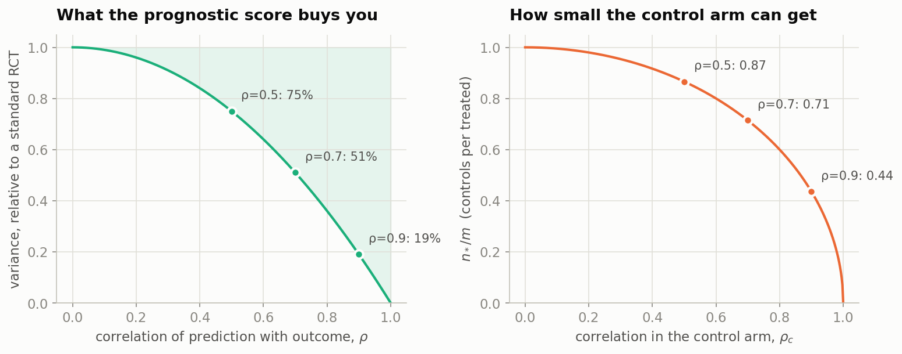
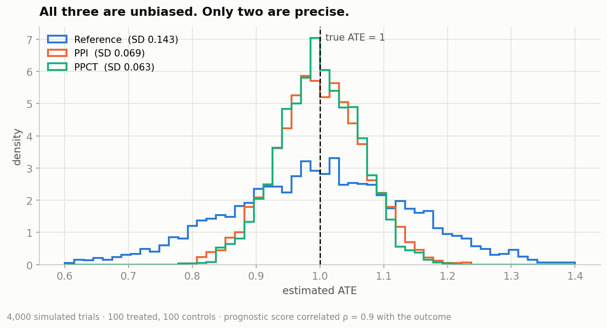
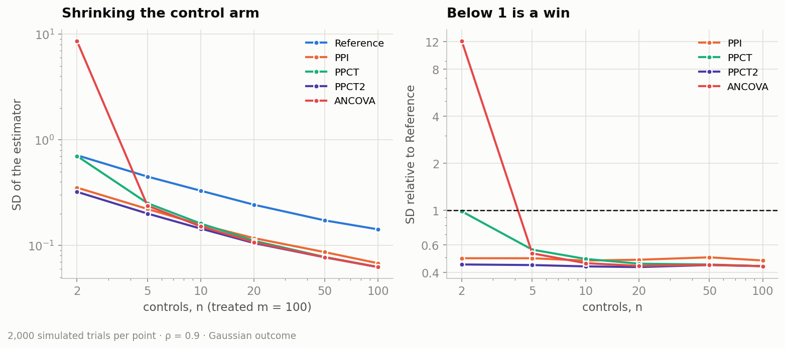
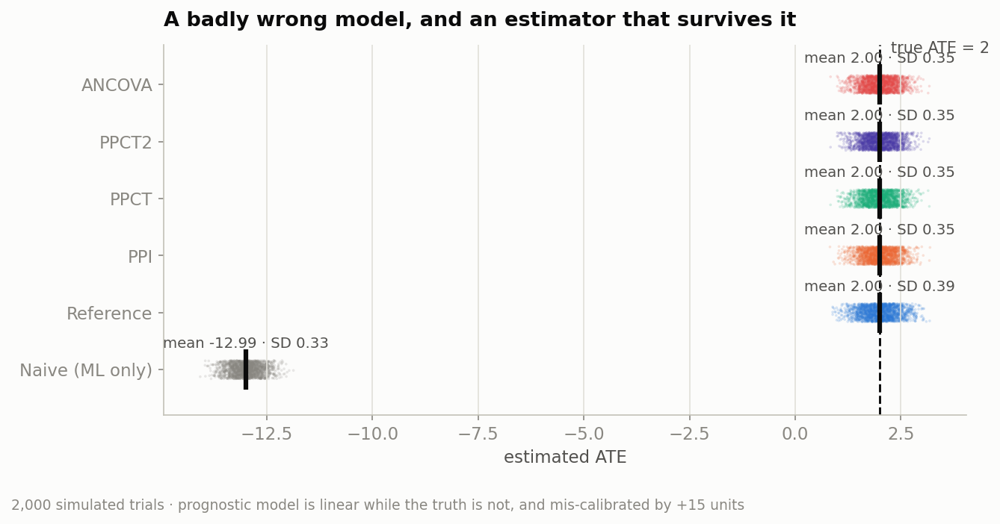
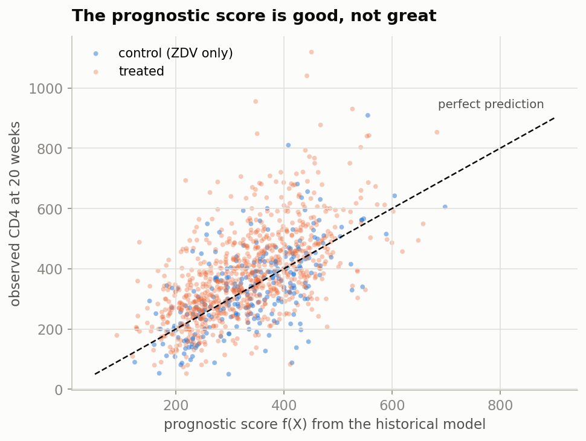
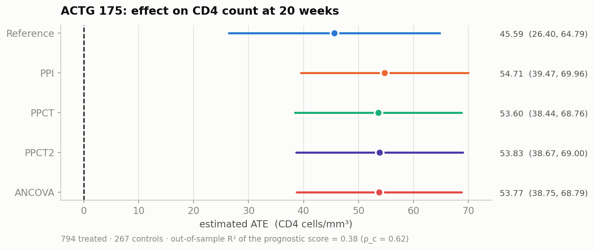
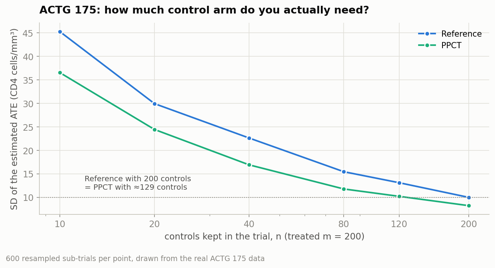
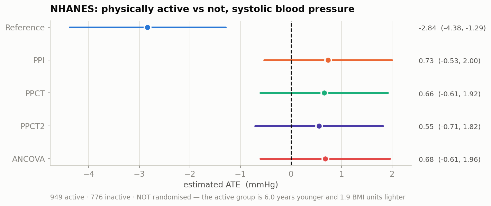

# Your Control Arm Is a Missing-Data Problem

### Prediction-powered inference sits exactly where causal inference meets transfer learning — and it can shrink the most expensive part of a randomized trial

---

Every randomized controlled trial runs on a counterfactual it can never see.

You want to know what a treated patient's outcome *would have been* had they not been treated. That number does not exist anywhere in your dataset, and it never will. So you build a control arm: a group of people, randomized away from the therapy under study, whose job is to stand in for the untreated version of everyone else. It works, and it is the single most expensive, slowest, and ethically fraught component of the whole enterprise.

Meanwhile, somewhere else in the same hospital system, there is a machine learning model trained on ten thousand historical patients that will happily predict that untreated trajectory for you, for free, in milliseconds.

The obvious move — use the model instead of the control arm — is a well-known way to get a wrong answer with great confidence. The interesting move is to use the model *and* a small control arm, in a way that keeps the statistical guarantees of the second while borrowing the precision of the first.

That's prediction-powered inference. This post is a tour of it, with code you can run, one simulated world where we know the truth, and one real HIV trial where we don't.

**Why this framing matters.** PPI is usually introduced as a machine learning paper, but for a statistician it lands squarely at the intersection of two older literatures:

- **Missing data / causal inference.** The fundamental problem of causal inference is a missing-data problem: we observe Y(1) or Y(0) for each person, never both. The control arm is an imputation device for the missing half.
- **Transfer learning.** The prognostic model comes from a *different* population — an earlier trial, a registry, an observational cohort — and we want to carry its knowledge into a new study whose distribution we can't assume matches.

PPI is the bridge. It uses a transferred model as a prognostic score, and then *rectifies* it against the trial's own control arm so that the missing-data problem is still solved correctly, even if the transfer was bad.

---

## 1. The classical approach, and what it costs

Start with the estimator that every trial protocol in the world already uses.

You have N participants: m assigned to treatment (T = 1), n assigned to control (T = 0). Y is a continuous outcome. The estimand is the average treatment effect:

```
ATE = E[Y | T = 1] − E[Y | T = 0]
```

and the **reference estimator** is just the difference in arm means:

```
ATE_ref = mean(Y among treated) − mean(Y among controls)
```

Under randomization this is unbiased, and its variance decomposes cleanly:

```
Var(ATE_ref) = σ²_t / m  +  σ²_c / n
```

Two terms. Two arms. And the second one is the expensive term — every unit of 1/n you buy costs you a real person, consented, enrolled, monitored, and deliberately not given the therapy you think might help them.

This is the lever that drives trial budgets. Want a narrower confidence interval? Lower the variance. Lower the variance how? Recruit more people. That's the whole classical playbook, and it is why a Phase III trial costs what a small office building costs.

**The one classical escape hatch** is covariate adjustment. If you have a baseline variable that predicts the outcome, regress it out and the residual variance shrinks. ANCOVA on a prognostic score is the standard form of this, and it is [approved by both the FDA and EMA](https://www.ema.europa.eu/en/adjustment-baseline-covariates-clinical-trials-scientific-guideline) as a legitimate way to reduce trial sample size. Schuler et al. (2022) formalized the "prognostic score as a super-covariate" version of the idea.

So the question this post is really about isn't "can we use external information?" — statisticians have been doing that for decades. It's: *can we use a modern black-box ML model as that external information, with a closed-form variance, without overfitting, and without assuming the model is any good?*

---

## 2. The naive idea, and exactly how it fails

Here is the temptation. You have a model f trained on historical data. Feed it the baseline covariates X of everyone in the trial and you get f(X) — a predicted untreated outcome for every participant, including the treated ones. These are sometimes called **digital twins**: a synthetic untreated version of each treated patient.

Now do the obvious thing:

```
ATE_naive = mean(Y among treated) − mean(f(X) over everyone)
```

No control arm required. Beautiful. And wrong, in a way that no amount of data fixes, because your model has a bias you cannot see. If f is systematically 15 units too high — because the historical cohort was sicker, or measured on a slightly different instrument, or drifted over five years — then your ATE is 15 units too low. Forever. More patients won't help; you'll just estimate the wrong number more precisely.

I ran this. In a simulation where the true ATE is 2.0 and the prognostic model is mis-calibrated by +15 units:

| Estimator | Mean estimate | SD |
|---|---|---|
| **Naive (ML only)** | **−12.99** | 0.33 |
| Reference (difference in means) | 2.00 | 0.386 |
| PPI | 2.00 | 0.349 |
| PPCT | 2.00 | 0.348 |

The naive estimator is off by exactly the calibration error, and its standard deviation is the *smallest in the table* — it is confidently, precisely wrong. That's the failure mode that makes regulators say no.

---

## 3. The fix: measure the model's bias and subtract it

Prediction-powered inference (Angelopoulos et al., *Science*, 2023) solves this with an idea so simple it's almost annoying: **you have a control arm. Use it to measure how wrong the model is.**

For the control patients you observe both Y and f(X), so you can compute the model's empirical bias directly. The PPI paper calls this the **rectifier**:

```
Δ̂ = mean over controls of ( Y − f(X) )
```

Subtract it from the naive estimate and the bias cancels. Writing the whole thing out, the PPI estimator of the ATE is:

```
ATE_PPI = mean over treated of ( Y − f(X) )
        − mean over controls of ( Y − f(X) )
```

Look at what that does. The predictions enter **twice, with opposite signs**. Whatever f gets systematically wrong — a constant offset, a misspecified functional form, the wrong link function, a five-year drift in the measurement instrument — appears in both terms and cancels.

This is the load-bearing property of the whole method:

> **The prognostic model does not need to be unbiased, calibrated, or even good. It needs to exist.**

The model contributes only *variance reduction*. The control arm is still doing the causal work. That's why this is legitimate in a way that the digital-twin approach is not.

---

## 4. Putting a dial on it

There's a catch, and it's the reason plain PPI doesn't go into protocols as-is.

The variance of ATE_PPI depends on how well f correlates with Y. Write ρ_c and ρ_t for the correlation between f(X) and Y within the control and treated arms. If ρ is high, PPI's variance is much lower than the reference estimator's. If ρ is **low**, PPI is *worse than doing nothing* — you've imported the model's noise and received no signal in exchange. In my simulations with an uninformative model (ρ = 0) and 100 patients per arm, PPI's standard deviation was 0.20 against the reference estimator's 0.14. You paid for the model in precision.

PPI++ (Angelopoulos, Duchi & Zrnic, 2023) fixes this by adding a weight λ on the predictions:

```
ATE_λ = mean over treated of ( Y − λ·f(X) )
      − mean over controls of ( Y − λ·f(X) )
```

Which is worth staring at for a second, because it's just a convex combination:

```
ATE_λ = (1 − λ)·ATE_ref  +  λ·ATE_PPI
```

λ = 0 gives you back the classical estimator. λ = 1 gives you plain PPI. And **every value of λ is unbiased**, because the rectifier structure is preserved for all of them. That's the gift: if a whole family of estimators is unbiased, you're free to pick the member with the smallest variance and pay nothing for the privilege.

Poulet et al. (2025) do exactly that for the clinical trial setting and call the result **PPCT** — Prediction-Powered for Clinical Trials. Minimizing the variance over λ gives a closed form:

```
λ* = ( π_c·σ_t·ρ_t  +  π_t·σ_c·ρ_c ) / σ_f
```

with π_t = m/N, π_c = n/N the arm proportions, σ_f the standard deviation of the prognostic score, and the variance becoming:

```
Var(ATE_PPCT) = σ²_t/m + σ²_c/n − (λ*)²·σ²_f·(1/n + 1/m)
                └────── the reference ──────┘   └── what prediction buys ──┘
```

The subtracted term is a square times a square. **It can never be negative.** So:

> **PPCT is never worse than the classical estimator.** With a useless model, λ* → 0 and PPCT *is* the classical estimator. With a perfect model, λ* → 1 and it becomes plain PPI.

That is the property that makes this deployable. There is no scenario where adopting it costs you power, which means there's no scenario where a statistician has to defend having tried it.

One practical wrinkle: λ* has to be estimated from the trial. The paper's default plug-in uses the arm-specific correlations, which is unstable when one arm is tiny — ρ̂_c gets multiplied by m, so a handful of controls can wag the whole estimator. Their **PPCT2** variant assumes ρ_c = ρ_t (reasonable under a constant treatment effect), which collapses λ* to a pooled Cov(Y, f)/Var(f). In my runs PPCT2 was the most stable estimator in the table at every sample size, and I'd default to it.

---

## 5. The exchange rate: ρ²

Everything above collapses to one number. If the prognostic score correlates ρ with the outcome, the variance falls to roughly **(1 − ρ²)** of the classical estimator's. That quantity is the out-of-sample R² of your prognostic model — which means you can *forecast your own variance reduction before the trial starts*, from a model you already have.


*Left: variance relative to a standard RCT, as a function of prediction quality. Right: the control-arm design rule.*

And in design terms — the number a trial statistician actually cares about — Poulet et al. derive that to match the power of a balanced RCT with m patients per arm, a PPCT-powered trial needs only

```
n* / m = √(1 − ρ_c²)
```

controls per treated patient:

| ρ_c | 0.0 | 0.3 | 0.5 | 0.7 | 0.8 | 0.9 | 1.0 |
|---|---|---|---|---|---|---|---|
| **n*/m** | 1.00 | 0.95 | 0.87 | 0.71 | 0.60 | 0.44 | 0.00 |

At ρ_c = 0.9 you need 44 controls per 100 treated. At ρ_c = 1 — a perfect prognostic model — you need none, which is the formal statement of the digital-twin dream, and also a useful reminder of how far a real model is from it.

Note the shape of that curve: it's *flat* at the left. A model with ρ = 0.3 buys you essentially nothing. The returns are brutally non-linear, and they only start paying around ρ ≈ 0.6.

---

## 6. Does it actually work? A simulated trial

Theory is cheap. Let's simulate 4,000 trials where we know the answer.

The generative model follows the paper: a control outcome Y_c, a constant treatment shift Δ = 1, and a prognostic score f(X) = Y_c + noise, with the noise calibrated so that corr(f, Y) = 0.9 in both arms. 100 treated, 100 controls.



| Estimator | Mean | SD | Variance vs Reference |
|---|---|---|---|
| Reference | 0.998 | 0.143 | 1.000 |
| PPI | 1.000 | 0.069 | 0.232 |
| PPCT | 1.000 | 0.063 | **0.193** |
| PPCT2 | 1.000 | 0.063 | 0.193 |
| ANCOVA | 1.000 | 0.063 | 0.192 |

All five center on the truth. PPCT's variance lands at 0.193 of the reference — theory predicted 1 − 0.9² = 0.190. The confidence interval is cut by more than half, from a model that never saw a single outcome from this trial.

Note also that PPCT beat plain PPI (0.193 vs 0.232). The optimal λ* averaged 0.81, not 1 — PPI's hard-coded λ = 1 left precision on the table even with a very good model.

### Where the estimators stop agreeing

The interesting regime is the unbalanced one, which is the whole point: we want to *shrink* the control arm. So fix m = 100 treated and starve the controls down to n = 2.



Three things happen, and they reproduce the paper's Table 2:

1. **ANCOVA falls apart.** At n = 2 its standard deviation is more than 10× the reference estimator's. You cannot fit a slope through two points and expect the variance estimate to behave. This is the practical gap between ANCOVA and PPCT: they're asymptotically equivalent, and they part company exactly in the regime that prediction-powered designs are built for.
2. **Plain PPI is a liability with a weak model.** With ρ = 0 it is strictly worse than doing nothing, at every sample size.
3. **PPCT and PPCT2 stay well-behaved everywhere**, with PPCT2 the most stable in the corner cases (skewed outcomes, tiny n, strong predictions) because its λ estimate pools both arms instead of leaning on a handful of controls.

One honest caveat from the same runs: at n = 20 with ρ = 0.9, the empirical type-I error of PPCT was 6.6% against a nominal 5% (PPCT2: 5.1%, reference: 5.8%). Estimating λ* from the trial data slightly understates the variance. It's the same phenomenon the paper flags — use PPCT2, or a permutation test, if you're in that regime.

### And when the model is wrong?

This is the experiment that decides whether you'd actually let this near a protocol. The prognostic model is wrong in two independent ways at once: it's a linear regression fitted to a world that is non-linear in every covariate, *and* it's trained on a historical cohort on a different scale, so every prediction is off by +15 units.



The naive digital-twin estimator lands at −12.99 against a true effect of 2.0. Every rectified estimator lands at 2.00. The model's bias is absorbed entirely by the rectifier; only its *correlation* with the outcome moves the variance — and here that correlation is a mediocre ρ ≈ 0.43, worth about a 10% variance reduction.

**A wrong model costs you nothing and gains you little.** That asymmetry is the entire safety argument for the method.

---

## 7. A real trial: ACTG 175

Simulations are where you go to be agreed with. Let's use real data.

ACTG 175 (Hammer et al., *NEJM* 1996) randomized 2,139 HIV-positive adults with baseline CD4 counts between 200 and 500 to zidovudine monotherapy or to one of three alternative regimens. It's public, it ships inside the R package `BART`, and it has everything we need:

- **outcome** — CD4 T-cell count at 20 ± 5 weeks (higher is better, fully observed);
- **treatment** — anything other than ZDV monotherapy;
- **15 baseline covariates** — age, weight, Karnofsky score, prior antiretroviral exposure, baseline CD4 and CD8, and so on.

**Building the transfer-learning setup.** I split the patients in half. One half becomes a *historical cohort*; from it I keep only the ZDV-only patients (265 of them) and fit a gradient-boosting model of CD4-at-20-weeks on baseline covariates. That's the stand-in for a disease progression model calibrated on a previous trial's control arm or a natural-history registry. The other half — 1,061 patients, 794 treated and 267 control — is the *target trial*, and the model never sees any of its outcomes.

The resulting prognostic score has an honest out-of-sample R² of **0.378** on the target trial's control arm, with ρ_c = 0.62 and ρ_t = 0.60. Good, not great — which is realistic.



Here's what the five estimators say:



| Estimator | ATE (CD4 cells/mm³) | SE | 95% CI | λ* | Var vs Ref |
|---|---|---|---|---|---|
| Reference | 45.59 | 9.80 | (26.40, 64.79) | — | 1.000 |
| PPI | 54.71 | 7.78 | (39.47, 69.96) | 1 | 0.631 |
| PPCT | 53.60 | 7.74 | (38.44, 68.76) | 0.878 | **0.624** |
| PPCT2 | 53.83 | 7.74 | (38.67, 69.00) | 0.903 | 0.624 |
| ANCOVA | 53.77 | 7.66 | (38.75, 68.79) | — | 0.612 |

The variance drops to 62% of the classical estimator's. Converted to design terms with the standard power formula, a future trial targeting the same effect at 80% power needs **62% of the participants** — for free, from a model trained on data that was already sitting there.

### Wait — why did the point estimate move?

Because it should have, and this is the most instructive number in the whole analysis.

Randomization balances covariates **in expectation**, not in any particular trial. In this split, the treated arm happened to draw patients with slightly worse baseline prognosis: their mean prognostic score is 330.6 against the controls' 339.7, an imbalance of −9.12. The naive difference in means silently charges the treatment for that bad luck.

PPCT corrects for it, and the arithmetic is exact:

```
λ* × imbalance   = 0.878 × (−9.12)  = −8.008
PPCT − Reference =  53.60 − 45.59   = +8.008
```

The estimate didn't drift. It moved by precisely λ* times the chance imbalance in prognosis. In a randomized trial that correction is mean-zero noise — it's as likely to go the other way — and here it happened to be a bit under one standard error. Hold that thought; it comes back in Section 8.

### How much control arm do you actually need?

The design question, answered on real patients. I resampled sub-trials out of ACTG 175 — a fixed 200 treated patients and a control arm shrunk from 200 down to 10, 600 times at each size — and measured the spread of each estimator.



The classical estimator with 200 controls is matched by PPCT with about **130**. Seventy patients who don't have to be randomized away from a therapy that turned out to work.

(The design rule √(1 − ρ_c²) = 0.78 gives a more conservative number, because it assumes a balanced reference design and equal arm variances. Treat the resampled curve as the empirical answer for *this* trial and the formula as the planning number.)

---

## 8. The bill: NHANES, and what breaks without randomization

Everything above makes PPI look like a free lunch. It isn't, and the price is a specific assumption that's easy to forget because it's usually satisfied by design.

So let's break it on purpose, using the transfer-learning story in its purest form. [NHANES](https://www.cdc.gov/nchs/nhanes/) is a repeated cross-sectional health survey. I trained the prognostic model on the **2009–10 wave** and treated the **2011–12 wave** as the target study. Outcome: average systolic blood pressure. "Treatment": whether the respondent reports being physically active.

Same code, same estimators, same everything — except nobody randomized anyone.



| Estimator | Effect (mmHg) | 95% CI | p |
|---|---|---|---|
| Reference | **−2.84** | (−4.38, −1.29) | 0.0003 |
| PPI | +0.73 | (−0.53, 2.00) | 0.26 |
| PPCT | +0.66 | (−0.61, 1.92) | 0.31 |
| ANCOVA | +0.68 | (−0.61, 1.96) | 0.30 |

The difference in means says physically active respondents run 2.8 mmHg lower, comfortably significant. Every prediction-powered estimator says the effect is indistinguishable from zero.

Run the same decomposition as before:

```
mean f(X):  active 117.82   inactive 121.39   imbalance = −3.57
λ* = 0.978
λ* × imbalance   = −3.492
PPCT − Reference = +3.492
```

Identical arithmetic. Completely different meaning. In ACTG 175 the imbalance was chance, and the correction was noise. Here the active respondents are **6.0 years younger and 1.9 BMI units lighter**, f(X) knows it — age and BMI are what it was trained on — and the "correction" is removing confounding.

Two lessons, pointing in opposite directions:

- **The variance reduction is real without randomization.** Resampling NHANES sub-trials gives a 15–20% standard-error cut, the same order as in ACTG 175. That half of PPI is just arithmetic about correlation, and it holds whatever the design.
- **The estimand is not.** ATE_λ equals the ATE *because* E[f(X) | T = 1] = E[f(X) | T = 0] under randomization. Break that and the same formula quietly estimates something else — a prognostic-score-adjusted contrast, which is arguably *closer* to the causal quantity you want here, but is still not identified, because the adjustment can only remove confounding that the model's covariates happen to capture.

> **PPI fixes variance. It does not fix confounding — and it will not tell you which of the two you had.**

If you take one thing from this post into your own work, take that. The method is safe under randomization in a way it absolutely is not outside it, and the output looks identical either way.

---

## 9. What to take away

1. **The rectifier is the whole trick.** Predictions enter twice with opposite signs, so systematic model error cancels. Unbiasedness does not depend on the model being right — which is what makes a black box admissible here.
2. **Use λ*, not λ = 1.** Plain PPI is worse than doing nothing when predictions are poor. PPCT is never worse than the classical estimator, by construction. Prefer the PPCT2 variant of λ̂* in small or unbalanced arms.
3. **The exchange rate is ρ².** A score correlated ρ with the outcome cuts variance to (1 − ρ²) and lets the control arm shrink to √(1 − ρ_c²) of balanced. Check your ρ before promising anyone a smaller trial — the curve is flat below ρ ≈ 0.6.
4. **The hard part is the model, not the estimator.** The estimator is forty lines of NumPy. Getting ρ_c above 0.6 for a *change* over the trial window, from baseline data alone, is a genuine research problem — it's the limitation Poulet et al. hit in their own Alzheimer's application, where their best disease progression model reached R² ≈ 15% on a secondary cognitive endpoint and close to zero on the trial's primary imaging endpoint.
5. **PPCT and ANCOVA are asymptotically equivalent**, and differ where it matters: tiny control arms, where ANCOVA's slope estimate breaks and the PPI form still has a closed-form variance. The PPI++ framing also generalizes beyond the linear/continuous case, to M-estimators, logistic and Cox regression — which is where this gets genuinely interesting for time-to-event endpoints.
6. **Randomization is load-bearing.** See Section 8.

---

## Run it yourself

Everything in this post — the estimator library, all five simulations, and both real-data analyses — is in a single notebook that downloads its own data and runs end to end on a free Colab CPU runtime in about five minutes.

**▶ [Open the notebook in Google Colab](https://colab.research.google.com/drive/1eypSG0QRy2jqBCV474LEOOUoQr0j-lkk?usp=sharing)**

The core estimator is short enough to paste here:

```python
def ppi_lambda(Y, T, F, lam):
    """PPI++ estimator at a fixed lambda."""
    F = F - F.mean()
    Yt, Yc, Ft, Fc = Y[T == 1], Y[T == 0], F[T == 1], F[T == 0]
    m, n = len(Yt), len(Yc)
    s_t, s_c, s_f = Yt.std(ddof=1), Yc.std(ddof=1), F.std(ddof=1)
    rho_t = np.corrcoef(Ft, Yt)[0, 1]
    rho_c = np.corrcoef(Fc, Yc)[0, 1]
    est = (Yt - lam * Ft).mean() - (Yc - lam * Fc).mean()
    var = ((s_t**2 + lam**2 * s_f**2 - 2*lam*s_f*s_t*rho_t) / m
         + (s_c**2 + lam**2 * s_f**2 - 2*lam*s_f*s_c*rho_c) / n)
    return est, var

def ppct(Y, T, F):
    """Same thing, at the variance-minimising lambda."""
    F = F - F.mean()
    Yt, Yc, Ft, Fc = Y[T == 1], Y[T == 0], F[T == 1], F[T == 0]
    m, n, N = len(Yt), len(Yc), len(Y)
    s_t, s_c, s_f = Yt.std(ddof=1), Yc.std(ddof=1), F.std(ddof=1)
    rho_t = np.corrcoef(Ft, Yt)[0, 1]
    rho_c = np.corrcoef(Fc, Yc)[0, 1]
    lam = ((n/N) * s_t * rho_t + (m/N) * s_c * rho_c) / s_f
    return ppi_lambda(Y, T, F, lam)
```

That's it. That's the method.

---

## References

**The paper this post is built on**

- Poulet P-E, Tran M, Tezenas du Montcel S, Dubois B, Durrleman S, Jedynak B (2025). Prediction-powered inference for clinical trials: application to linear covariate adjustment. *BMC Medical Research Methodology* 25:204. https://doi.org/10.1186/s12874-025-02647-6

**The PPI line of work**

- Angelopoulos AN, Bates S, Fannjiang C, Jordan MI, Zrnic T (2023). Prediction-powered inference. *Science* 382(6671):669–674. https://doi.org/10.1126/science.adi6000
- Angelopoulos AN, Duchi JC, Zrnic T (2023). PPI++: Efficient prediction-powered inference. https://arxiv.org/abs/2311.01453
- Schultz J, Prince JL, Jedynak BM (2024). Predictive powered inference for healthcare: relating optical coherence tomography scans to multiple sclerosis progression. *Machine Learning for Healthcare (PMLR)*. https://proceedings.mlr.press/v252/schultz24a.html

**Covariate adjustment and prognostic scores**

- Schuler A, Walsh D, Hall D, Walsh J, Fisher C (2022). Increasing the efficiency of randomized trial estimates via linear adjustment for a prognostic score. *International Journal of Biostatistics* 18(2):329–356. https://doi.org/10.1515/ijb-2021-0072
- European Medicines Agency (2015). *Guideline on adjustment for baseline covariates in clinical trials.* https://www.ema.europa.eu/en/adjustment-baseline-covariates-clinical-trials-scientific-guideline
- Li L (2022). Prognostic Factor Analyses. In: Piantadosi S, Meinert CL (eds), *Principles and Practice of Clinical Trials*. Springer, 1771–87. https://doi.org/10.1007/978-3-319-52636-2_121
- Holzhauer B, Adewuyi ET (2023). "Super-covariates": using predicted control group outcome as a covariate in randomized clinical trials. *Pharmaceutical Statistics* 22(6):1062–75. https://doi.org/10.1002/pst.2329

**Borrowing external and historical controls**

- Signorovitch JE, Sikirica V, Erder MH, et al. (2012). Matching-adjusted indirect comparisons: a new tool for timely comparative effectiveness research. *Value in Health* 15(6):940–7. https://doi.org/10.1016/j.jval.2012.05.004
- Burman CF, Hermansson E, Bock D, Franzén S, Svensson D (2024). Digital twins and Bayesian dynamic borrowing: two approaches for incorporating historical control data. *Pharmaceutical Statistics*. https://doi.org/10.1002/pst.2376

**Data**

- Hammer SM, Katzenstein DA, Hughes MD, et al. (1996). A trial comparing nucleoside monotherapy with combination therapy in HIV-infected adults with CD4 cell counts from 200 to 500 per cubic millimeter. *New England Journal of Medicine* 335:1081–1090. DOI: 10.1056/NEJM199610103351501. — ACTG 175; the analysis dataset is distributed in the R package `BART` (and in `speff2trial`).
- CDC National Center for Health Statistics. *National Health and Nutrition Examination Survey*, 2009–10 and 2011–12 waves. https://www.cdc.gov/nchs/nhanes/ — accessed via the R package `NHANES`.

---

*Code and figures: [GitHub repository](https://github.com/Nahin277/PPI_Clinical_Trials) · [Colab notebook](https://colab.research.google.com/drive/1O1iMHHubitqRVcL1gQa8zscXnjm3UiDJ)*
